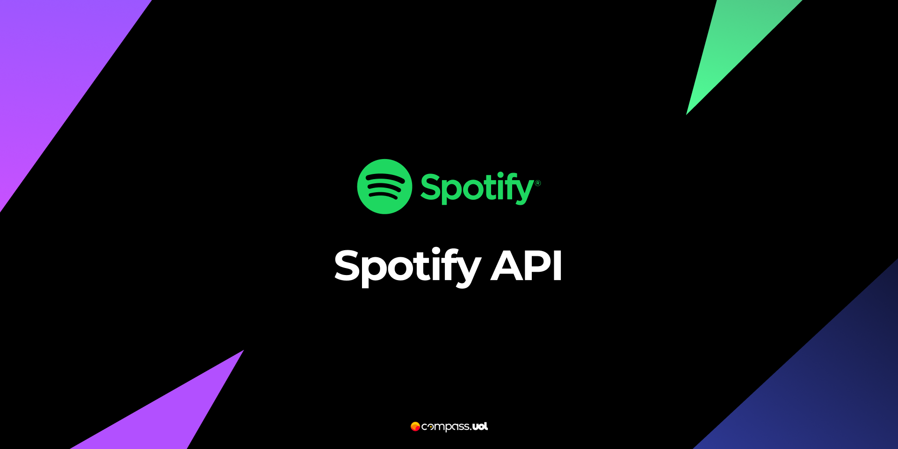
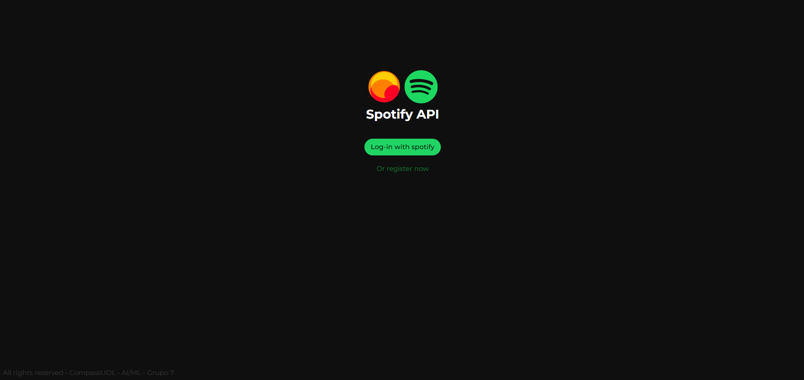
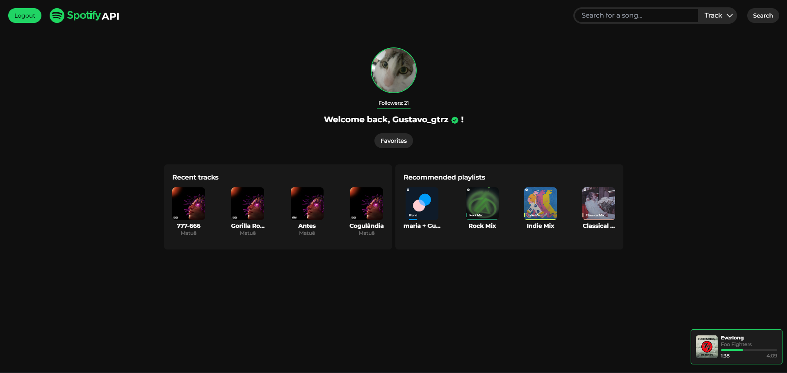
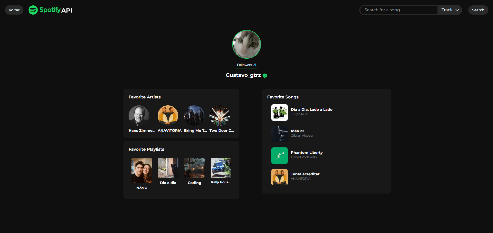
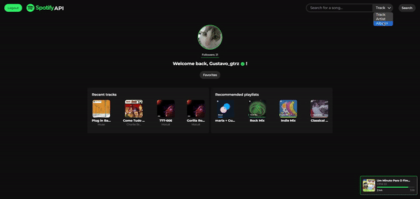
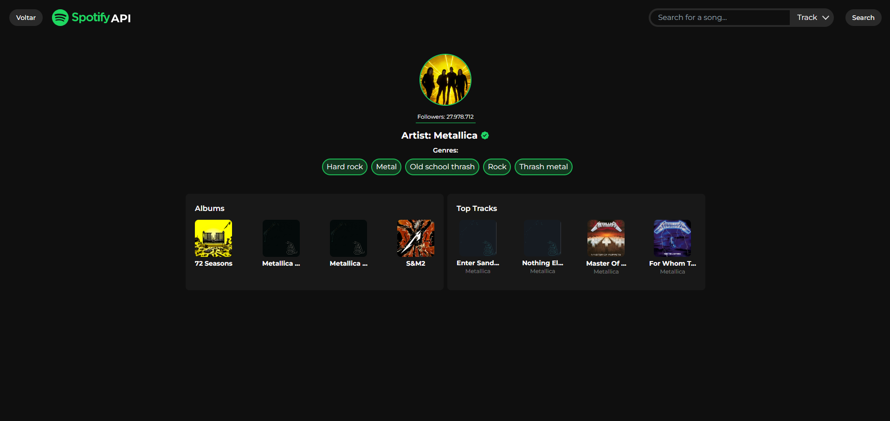

# Spotify API 🎵



API desenvolvida para consumir dados da API do Spotify e integrá-los em uma aplicação com interface gráfica.

**Autores**: Giovanna Gutierrez, Gustavo Gutierrez, João Henrique de Oliveira, João Victor Ferrari de Melo

---

## Sumário 📚
1. [URL da Aplicação](#url-da-aplicação)
2. [Desafios Encontrados](#desafios-encontrados-durante-o-desenvolvimento)
3. [Tecnologias Utilizadas](#tecnologias-utilizadas-no-projeto)
4. [Estrutura de arquivos/pastas](#estrutura-de-arquivos-pastas)
5. [Pré-requisitos ](#pré-requisitos)
6. [Instalação](#instalação)
7. [Acessar o APP](#acessar-o-app)
8. [Endpoints (API)](#endpoints-api)
   - [Autenticação `/auth`](#autenticação-auth)
   - [Dados do Usuário `/me`](#dados-do-usuário-me)
   - [Player de Músicas `/player`](#player-de-músicas-player)
   - [Pesquisa `/search`](#pesquisa-search)
   - [Artistas `/artists`](#artistas-artists)
   - [Albuns `/albums`](#albuns-albums)
9. [Telas (APP)](#telas-app)

---

## URL da Aplicação

[Clique aqui para acessar](http://54.211.154.46/)

---

## Desafios Encontrados Durante o Desenvolvimento

- **Implementação da autenticação do Spotify**:
  - Gestão de tokens (refresh token e access token)
- **Arquitetura de Rede da AWS**:
  - Configuração e otimização da infraestrutura
- **Complexidade da API do Spotify**:
  - Integração de múltiplos endpoints e gestão de permissões

---

## Tecnologias Utilizadas no Projeto


---

## Estrutura de arquivos/pastas

**API:**

```
API/
├── controllers/
│   ├── albumController.js
│   ├── artistController.js
│   ├── authController.js
│   ├── meController.js
│   ├── playerController.js
│   └── searchController.js
├── middlewares/
│   └── verifyToken.js
├── routes/
│   ├── albumRoutes.js
│   ├── artistRoutes.js
│   ├── authRoutes.js
│   ├── meRoutes.js
│   ├── playerRoutes.js
│   └── searchRoutes.js
├── services/
│   └── spotifyServices.js
├── utils/
│   └── sendError.js
├── .env
├── dockerfile
├── index.js
├── package-lock.json
└── package.json
```

**APP:**

```
APP/
├── controllers/
│   ├── albumController.js
│   ├── artistController.js
│   ├── favoritesController.js
│   ├── homeController.js
│   ├── playTrackController.js
│   ├── redirectController.js
│   └── spotifyController.js
├── middlewares/
│   └── verifyAccessToken.js
├── public_src/
│   ├── images/
│   │   ├── arrow.svg
│   │   ├── compassucologo.png
│   │   ├── play-button.svg
│   │   ├── SpotifyAPILogo.svg
│   │   ├── SpotifyLogo.svg
│   │   ├── sprintbanner.png
│   │   └── verifiedIcon.svg
│   ├── scripts/
│   │   └── utils/
│   │       ├── homeScript.js
│   │       └── searchScript.js
│   └── styles/
│       └── style.css
├── routes/
│   ├── albumRoutes.js
│   ├── artistRoutes.js
│   ├── favoritesRoutes.js
│   ├── homeRoutes.js
│   ├── playTrackRoutes.js
│   ├── redirectRoutes.js
│   └── spotifyRoutes.js
├── views/
│   ├── album.ejs
│   ├── artistProfile.ejs
│   ├── favorites.ejs
│   ├── home.ejs
│   ├── index.ejs
│   ├── redirect.ejs
│   ├── search.ejs
│   ├── searchAlbum.ejs
│   └── searchArtist.ejs
├── .env
├── dockerfile
├── index.js
├── package-lock.json
├── package.json
└── tailwind.config.js

```

## Pré-requisitos

- Conta no Spotify
- Git
- Docker
- Docker Compose

---

## Instalação

1. **Clone o repositório com git**:

   ```bash
   git clone https://github.com/Compass-pb-aws-2024-JULHO-A/sprints-2-3-pb-aws-julho-a.git
   ```

2. **Acesse a branch do grupo**:

   ```bash
   git checkout grupo-7
   ```

3. **Crie as variáveis de ambiente no diretório raiz de cada servidor (APP e API)**:

   **API**:

   ```env
   PORT=3000
   SPOTIFY_REDIRECT_URI=http://[IPv4 da máquina]:3000/auth/callback
   SPOTIFY_CLIENT_ID=[Client ID de sua aplicação]
   SPOTIFY_CLIENT_SECRET=[Client secret de sua aplicação]
   SESSION_SECRET=api-spotify
   FRONTEND_URL=http://[IPv4 da máquina]:80
   ```

   **APP**:

   ```env
   PORT=80
   SPOTIFY_REDIRECT_URI=http://[IPv4 da máquina]:80/auth
   SPOTIFY_CLIENT_ID=[Client ID de sua aplicação]
   SPOTIFY_CLIENT_SECRET=[Client secret de sua aplicação]
   SESSION_SECRET=api-spotify
   API_URL=http://[IPv4 da máquina]:3000
   ```

4. **Execute os comandos**:

   *Lembre-se de executar os comandos na raíz do repositório*

   ```bash
   docker-compose build
   ```

   Após o build, execute:

   ```bash
   docker-compose up
   ```

---

## Acessar o APP

Acesse o APP no navegador utilizando o IPv4 da sua máquina ou `localhost`:

`http://localhost:80` ou `http://[IPv4]:80`

---

## Endpoints (API)

A API estará rodando na porta definida no arquivo `.env` ou na porta padrão `3000`.

### Autenticação `/auth`

Autenticação do usuário com OAuth 2.0.

- **GET `/auth`**: Realiza o processo de autenticação.
- **GET `/auth/callback`**: Callback para troca de código por `access_token` e `refresh_token`.
- **GET `/auth/refresh`**: Atualiza o `access_token`.

### Dados do Usuário `/me`

- **GET `/me`**: Retorna os dados do usuário.
- **GET `/me/top-artists`**: Lista dos top artistas do usuário.
- **GET `/me/top-tracks`**: Lista das top faixas do usuário.
- **GET `/me/saved-tracks`**: Músicas salvas na biblioteca do usuário.
- **GET `/me/recently-played`**: Últimas músicas reproduzidas.
- **GET `/me/recommendations`**: Recomendações personalizadas.
- **GET `/me/playlists`**: Playlists do usuário.

### Player de Músicas `/player`

- **GET `/player/current-track`**: Dados da música atual.
- **GET `/player/play/:search`**: Reproduz a música fornecida.

### Pesquisa `/search`

- **GET `/search/:type/:name`**: Busca no catálogo do Spotify.
  - `type`: track, artist, album
  - `name`: Sequência de palavras-chave

### Artistas `/artists`

- **GET `/artists/:id`**: Dados sobre o artista.
- **GET `/artists/:id/albums`**: Lista de álbuns do artista.
- **GET `/artists/:id/top-tracks`**: Top faixas do artista.

### Albuns `/albums`

- **GET `/albums/:id`**: Dados sobre o álbum.

---

## Telas (APP)

### Login



### Home



### Favoritos



### Search



### Artista



### Album


