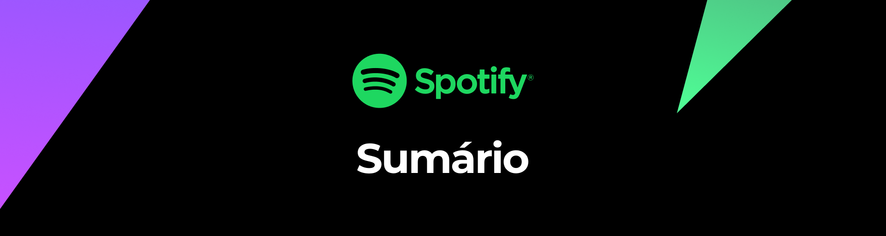
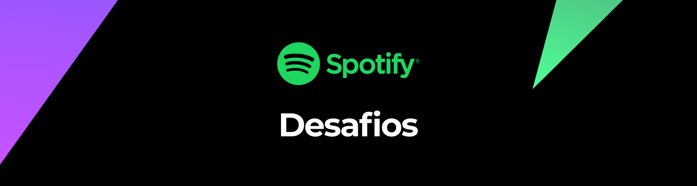
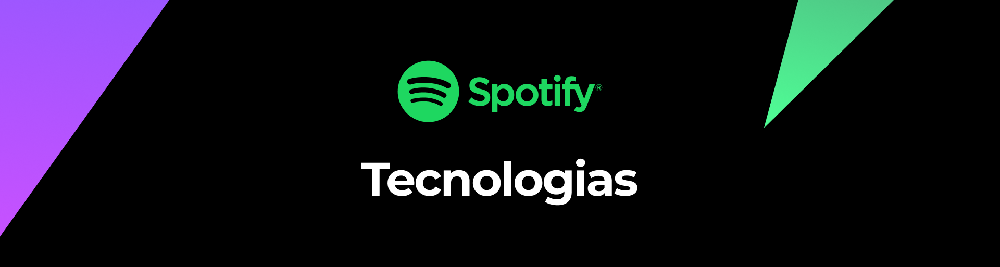
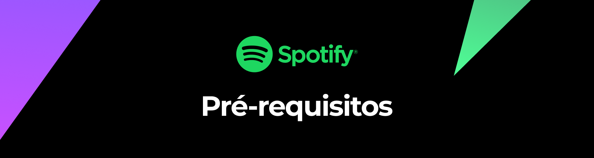
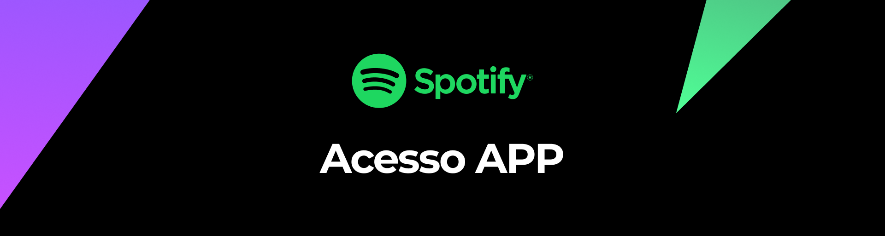
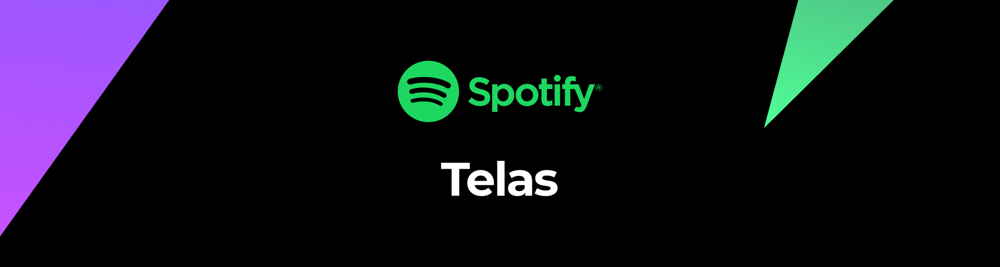
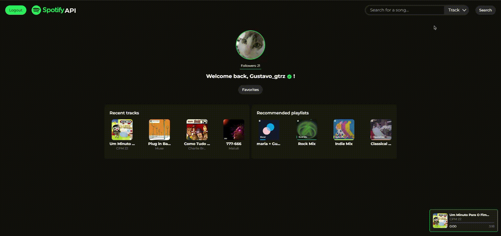
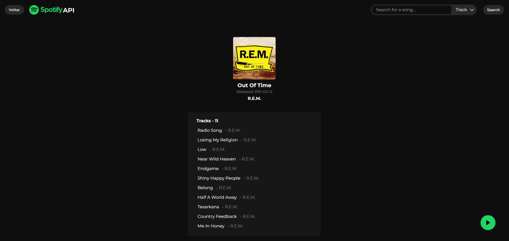
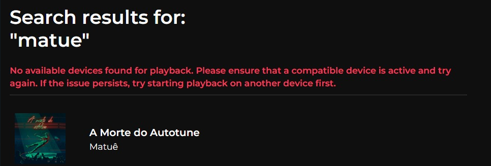

# Spotify API 🎵


API desenvolvida para consumir dados da API do Spotify e integrá-los em uma aplicação com interface gráfica.

**Autores**: Giovanna Gutierrez, Gustavo Gutierrez, João Henrique de Oliveira, João Victor Ferrari de Melo

---


## Sumário 📚
1. [URL da Aplicação](#url-da-aplicação)
2. [Desafios Encontrados](#desafios-encontrados-durante-o-desenvolvimento)
3. [Tecnologias Utilizadas](#tecnologias-utilizadas-no-projeto)
4. [Estrutura de arquivos e pastas](#estrutura-de-arquivos-e-pastas)
5. [Pré-requisitos ](#pré-requisitos)
6. [Instalação](#instalação)
7. [Acessar o APP](#acessar-o-app)
8. [Endpoints (API)](#endpoints-api)
   - [Autenticação `/auth`](#autenticação-auth)
   - [Dados do Usuário `/me`](#dados-do-usuário-me)
   - [Player de Músicas `/player`](#player-de-músicas-player)
   - [Pesquisa `/search`](#pesquisa-search)
   - [Artistas `/artists`](#artistas-artists)
   - [Albuns `/albums`](#albuns-albums)
9. [Telas (APP)](#telas-app)
10. [Solução de problemas](#solução-de-problemas)
      - [No available devices](#no-available-devices)

---


## URL da Aplicação

[Clique aqui para acessar](http://54.211.154.46/)

---


## Desafios Encontrados Durante o Desenvolvimento

- **Implementação da autenticação do Spotify**:
  - Gestão de tokens (refresh token e access token)
- **Arquitetura de Rede da AWS**:
  - Configuração e otimização da infraestrutura
- **Complexidade da API do Spotify**:
  - Integração de múltiplos endpoints e gestão de permissões

---


## Tecnologias Utilizadas no Projeto


---


## Estrutura de arquivos e pastas

**API:**

```
API/
├── controllers/
│   ├── albumController.js
│   ├── artistController.js
│   ├── authController.js
│   ├── meController.js
│   ├── playerController.js
│   └── searchController.js
├── middlewares/
│   └── verifyToken.js
├── routes/
│   ├── albumRoutes.js
│   ├── artistRoutes.js
│   ├── authRoutes.js
│   ├── meRoutes.js
│   ├── playerRoutes.js
│   └── searchRoutes.js
├── services/
│   └── spotifyServices.js
├── utils/
│   └── sendError.js
├── .env
├── dockerfile
├── index.js
├── package-lock.json
└── package.json
```

**APP:**

```
APP/
├── controllers/
│   ├── albumController.js
│   ├── artistController.js
│   ├── favoritesController.js
│   ├── homeController.js
│   ├── playTrackController.js
│   ├── redirectController.js
│   └── spotifyController.js
├── middlewares/
│   └── verifyAccessToken.js
├── public_src/
│   ├── images/
│   │   ├── arrow.svg
│   │   ├── compassucologo.png
│   │   ├── play-button.svg
│   │   ├── SpotifyAPILogo.svg
│   │   ├── SpotifyLogo.svg
│   │   ├── sprintbanner.png
│   │   └── verifiedIcon.svg
│   ├── scripts/
│   │   └── utils/
│   │       ├── homeScript.js
│   │       └── searchScript.js
│   └── styles/
│       └── style.css
├── routes/
│   ├── albumRoutes.js
│   ├── artistRoutes.js
│   ├── favoritesRoutes.js
│   ├── homeRoutes.js
│   ├── playTrackRoutes.js
│   ├── redirectRoutes.js
│   └── spotifyRoutes.js
├── views/
│   ├── album.ejs
│   ├── artistProfile.ejs
│   ├── favorites.ejs
│   ├── home.ejs
│   ├── index.ejs
│   ├── redirect.ejs
│   ├── search.ejs
│   ├── searchAlbum.ejs
│   └── searchArtist.ejs
├── .env
├── dockerfile
├── index.js
├── package-lock.json
├── package.json
└── tailwind.config.js

```


## Pré-requisitos

- Conta no Spotify
- Git
- Docker
- Docker Compose

---


## Instalação

1. **Clone o repositório com git**:

   ```bash
   git clone https://github.com/Compass-pb-aws-2024-JULHO-A/sprints-2-3-pb-aws-julho-a.git
   ```

2. **Acesse a branch do grupo**:

   ```bash
   git checkout grupo-7
   ```

3. **Crie as variáveis de ambiente no diretório raiz de cada servidor (APP e API)**:

   **API**:

   ```env
   PORT=3000
   SPOTIFY_REDIRECT_URI=http://[IPv4 da máquina]:3000/auth/callback
   SPOTIFY_CLIENT_ID=[Client ID de sua aplicação]
   SPOTIFY_CLIENT_SECRET=[Client secret de sua aplicação]
   SESSION_SECRET=api-spotify
   FRONTEND_URL=http://[IPv4 da máquina]:80
   ```

   **APP**:

   ```env
   PORT=80
   SPOTIFY_REDIRECT_URI=http://[IPv4 da máquina]:80/auth
   SPOTIFY_CLIENT_ID=[Client ID de sua aplicação]
   SPOTIFY_CLIENT_SECRET=[Client secret de sua aplicação]
   SESSION_SECRET=api-spotify
   API_URL=http://[IPv4 da máquina]:3000
   ```

4. **Execute os comandos**:

   *Lembre-se de executar os comandos na raíz do repositório*

   ```bash
   docker-compose build
   ```

   Após o build, execute:

   ```bash
   docker-compose up
   ```

---


## Acessar o APP

Acesse o APP no navegador utilizando o IPv4 da sua máquina ou `localhost`:

`http://localhost:80` ou `http://[IPv4]:80`

---


## Endpoints (API)

A API estará rodando na porta definida no arquivo `.env` ou na porta padrão `3000`.

### Autenticação `/auth`

Autenticação do usuário com OAuth 2.0.

- **GET `/auth`**: Realiza o processo de autenticação.
- **GET `/auth/callback`**: Callback para troca de código por `access_token` e `refresh_token`.
- **GET `/auth/refresh`**: Atualiza o `access_token`.

     Exemplo de resposta:
  
   ```json
      {
       "access_token" : "string",
       "refresh_token" : "string"
      }
   ```

### Dados do Usuário `/me`

- **GET `/me`**: Retorna os dados do usuário.

     Exemplo de resposta:

     ```json
      {
       "id": "string",
       "name": "string",
       "email": "string",
       "country": "BR",
       "link": "urlParaPerfilNoSite",
       "product": "tipoDeConta",
       "followers": number,
       "images": [
           {
               "url": "urlDaImagem",
               "height": 64,
               "width": 64
           },
           {
               "url": "urlDaImagem",
               "height": 300,
               "width": 300
           }
       ]
      }
     ```
- **GET `/me/top-artists`**: Lista dos top artistas do usuário.

     Exemplo de resposta:

     ```json
         [
       {
           "id": "IdDoArtista",
           "name": "NomeDoArtista",
           "genres": [
               "genero1", "genero2"
           ],
           "followers": number,
           "popularity": number0-100,
           "images": [
               {
                   "height": 640,
                   "url": "urlDaImagem",
                   "width": 640
               },
               {
                   "height": 320,
                   "url": "urlDaImagem",
                   "width": 320
               },
               {
                   "height": 160,
                   "url": "urlDaImagem",
                   "width": 160
               }
           ],
           "url": "urlDoPerfilDoArtista"
       },
       {
           ...Outros Artistas
       }
      ]
     ```
- **GET `/me/top-tracks`**: Lista das top faixas do usuário.

     Exemplo de resposta:
  
   ```json
   [
    {
        "id": "IdDaMusica",
        "name": "nomeDaMusica",
        "artists": [
            {
                "name": "NomeArtista",
                "url": "urlPerfilArtista"
            },
            {
                ...Outros Artistas
            }
        ],
        "album": {
            "name": "NomeDoAlbum",
            "images": [
                {
                    "height": 640,
                    "url": "urlImagemAlbum",
                    "width": 640
                },
                {
                    "height": 300,
                    "url": "urlImagemAlbum",
                    "width": 300
                },
                {
                    "height": 64,
                    "url": "urlImagemAlbum",
                    "width": 64
                }
            ],
            "url": "urlAlbum"
        },
        "duration": numberEmMilisegundos,
        "popularity": number0-100,
        "url": "urlMusica"
    },
    {
        ...Outras Musicas
    }
   ]
   ```

- **GET `/me/saved-tracks`**: Músicas salvas na biblioteca do usuário.

     Exemplo de resposta:
  
   ```json
      [
    {
        "name": "nomeMusica",
        "artists": [
            {
                "name": "nomeArtista",
                "url": "urlPerfilArtista"
            },
            {
                ...Outros Artistas
            }
        ],
        "album": {
            "name": "NomeAlbum",
            "images": [
                {
                    "height": 640,
                    "url": "urlImagemAlbum",
                    "width": 640
                },
                {
                    "height": 300,
                    "url": "urlImagemAlbum",
                    "width": 300
                },
                {
                    "height": 64,
                    "url": "urlImagemAlbum",
                    "width": 64
                }
            ],
            "url": "urlAlbum"
        },
        "duration": numberEmMilisegundos,
        "popularity": number0-100,
        "url": "urlMusica"
    },
    {
        ...Outras Musicas
    }
   ]
   ```
   
- **GET `/me/recently-played`**: Últimas músicas reproduzidas.

     Exemplo de resposta:
  
   ```json
       [
          {
              "id": "idMusica",
              "name": "nomeMusica",
              "artists": [
                  {
                      "name": "nomeArtista",
                      "url": "urlPerfilArtista"
                  },
                  {
                      ...Outros Artistas
                  }
              ],
              "album": {
                  "name": "nomeAlbum",
                  "images": [
                      {
                          "height": 640,
                          "url": "urlImagemAlbum",
                          "width": 640
                      },
                      {
                          ...outras imagens
                      }
                  ],
                  "url": "urlAlbum"
              },
              "duration_ms": numberEmMilisegundos,
              "popularity": number0-100,
              "url": "urlMusica",
              "played_at": "dataUltimaVezTocada"
          },
          {
              ...outras musicas
          }
      ]   
   ```
  
- **GET `/me/recommendations`**: Recomendações personalizadas.

     Exemplo de resposta:
  
   ```json
   [
    {
        "id": "IdDaPlaylist",
        "name": "nomeDaPlaylist",
        "description": "descricaoDaPlaylist",
        "images": [
            {
                "height": null,
                "url": "urlImagemPlaylist",
                "width": null
            }
        ],
        "url": "urlPlaylist"
    },
    {
        ...Outras Playlists
    }
   ]
   ```
   
- **GET `/me/playlists`**: Playlists do usuário.

     Exemplo de resposta:
  
   ```json
   [
    {
        "id": "idDaPlaylist",
        "name": "nomeDaPlaylist",
        "description": "DescricaoDaPlaylist",
        "images": [
            {
                "height": 640,
                "url": "urlImagemPlaylist",
                "width": 640
            },
            {
                "height": 300,
                "url": "urlImagemPlaylist",
                "width": 300
            },
            {
                "height": 60,
                "url": "urlImagemPlaylist",
                "width": 60
            }
        ],
        "url": "urlPlaylist"
    },
    {
        ...Outras Playlists
    }
   ]
   ```

### Player de Músicas `/player`

- **GET `/player/current-track`**: Dados da música atual.
  
     Exemplo de resposta:
  
   ```json
   {
    "name": "nomeMusicaAtual",
    "artists": [
        {
            "name": "nomeArtista",
            "url": "urlPerfilArtista"
        },
        {
            ...Outros Artistas
        }
    ],
    "album": {
        "name": "nomeAlbum",
        "images": [
            {
                "height": 640,
                "url": "urlImagemAlbum",
                "width": 640
            },
            {
                "height": 300,
                "url": "urlImagemAlbum",
                "width": 300
            },
            {
                "height": 64,
                "url": "urlImagemAlbum",
                "width": 64
            }
        ],
        "url": "urlAlbum"
    },
    "duration_ms": numberEmMilisegundos,
    "popularity": number0-100,
    "url": "urlMusica",
    "is_playing": boolean,
    "progress_ms": numberEmMilisegundos
   }
   ```
   
- **GET `/player/play/:search`**: Reproduz a música fornecida.

     Exemplo de resposta:
  
   ```json
   {
    status: 204
   }
   ```

### Pesquisa `/search`

- **GET `/search/:type/:name`**: Busca no catálogo do Spotify.
  - `type`: track, artist, album
  - `name`: Sequência de palavras-chave
 
     Exemplo de resposta:

   `:type` = "artist"

   ```json
   {
    "type": "artist",
    "results": [
        {
            "id": "idDoArtista",
            "name": "nomeDoArtista",
            "followers": number,
            "popularity": number0-100,
            "images": [
                "urlImagem1",
                "urlImagem2",
                "urlImagem3"
            ],
            "genres": [
                "genero1",
                "genero2",
                ...
            ],
            "url": "urlPerfilArtista"
        },
        {
            ...Outros Artistas Relacionados
        }
    ]
   }
   ```

   `:type` = "track"

  ```json
   {
    "type": "track",
    "results": [
        {
            "id": "idMusica",
            "name": "nomeMusica",
            "artists": [
                {
                    "name": "nomeArtista",
                    "url": "urlPerfilArtista"
                }
            ],
            "album": {
                "name": "A Morte do Autotune",
                "images": [
                    {
                        "height": 640,
                        "url": "urlImagemAlbum",
                        "width": 640
                    },
                    {
                        "height": 300,
                        "url": "urlImagemAlbum",
                        "width": 300
                    },
                    {
                        "height": 64,
                        "url": "urlImagemAlbum",
                        "width": 64
                    }
                ],
                "url": "urlAlbum"
            },
            "duration": numberEmMilisegundos,
            "popularity": number0-100,
            "url": "urlMusica"
        },
        {
            ...Outras Musicas Relacionadas
        }
    ]
   }
  ```

   `:type` = "album"

  ```json
   {
    "type": "album",
    "results": [
        {
            "id": "idAlbum",
            "name": "nomeAlbum",
            "images": [
                {
                    "height": 640,
                    "url": "urlImagemAlbum",
                    "width": 640
                },
                {
                    "height": 300,
                    "url": "urlImagemAlbum",
                    "width": 300
                },
                {
                    "height": 64,
                    "url": "urlImagemAlbum",
                    "width": 64
                }
            ],
            "artists": [
                {
                    "name": "nomeArtista",
                    "url": "urlPerfilArtista"
                }
                {
                    ...Outros Artistas
                }
            ],
            "url": "urlAlbum"
        },
        {
            ...Outros Albuns Relacionados
        }
    ]
   }
  ```

### Artistas `/artists`

- **GET `/artists/:id`**: Dados sobre o artista.

     Exemplo de resposta:
  
   ```json
   {
    "name": "nomeDoArtista",
    "genres": [
        "genero1",
        "genero2",
        ...
    ],
    "followers": number,
    "popularity": number0-100,
    "images": [
        {
            "url": "urlImagem",
            "height": 640,
            "width": 640
        },
        {
            ...outras imagens
        },
        
    ],
    "url": "perfilArtista",
    "id": "idArtista"
   }
   ```
   
- **GET `/artists/:id/albums`**: Lista de álbuns do artista.

     Exemplo de resposta:
  
   ```json
   [
    {
        "id": "idAlbum",
        "name": "nomeAlbum",
        "release_date": "dataLancamento",
        "total_tracks": number,
        "images": [
            {
                "url": "urlImagem",
                "height": 640,
                "width": 640
            },
            {
                ...outras imagens
            }
        ],
        "url": "urlAlbum"
    },
   ]
   ```
   
- **GET `/artists/:id/top-tracks`**: Top faixas do artista.

     Exemplo de resposta:
  
   ```json
   [
    {
        "id": "idMusica",
        "name": "nomeMusica",
        "artists": [
            {
                "name": "nomeArtista",
                "url": "urlPerfilArtista"
            }
            {
                ...Outros Artistas
            }
        ],
        "album": {
            "name": "nomeAlbum",
            "images": [
                {
                    "url": "urlImagem",
                    "height": 640,
                    "width": 640
                },
                {
                    ...outras imagens
                }
            ],
            "url": "urlAlbum"
        },
        "duration": numberEmMilisegundos,
        "popularity": number0-100,
        "url": "urlMusica"
    },
    {
        ...Outras Musicas
    }
   ]
   ```

### Albuns `/albums`

- **GET `/albums/:id`**: Dados sobre o álbum.

     Exemplo de resposta:
  
   ```json
   {
    "name": "nomeAlbum",
    "genre": [
        "genero1"
    ],
    "artists": [
        {
            "id": "idArtista",
            "name": "nomeArtista",
            "url": "urlPerfilArtista"
        },
        {
            ...Outros Artistas
        }
    ],
    "release_date": "dataLancamento",
    "total_tracks": number,
    "tracks": [
        {
            "id": "idMusica",
            "name": "nomeMusica",
            "artists": [
                {
                    "id": "idArtista",
                    "name": "nomeArtista",
                    "url": "urlPerfilArtista"
                }
                {
                    ...Outros Artistas
                }
            ],
            "url": "urlMusica"
        },
        {
            ...Outras Musicas
        }
    ],
    "images": [
        {
            "url": "urlImagem",
            "height": 640,
            "width": 640
        },
        {
            ...outras imagens
        }
    ],
    "url": "urlAlbum",
   }
   ```
   
---


## Telas (APP)

### Login

A tela de login permite ao usuário acessar o aplicativo utilizando sua conta do Spotify, por meio da autenticação OAuth 2.0.


### Home

A tela inicial exibe informações relevantes e personalizadas sobre o perfil do usuário, com base nos dados da sua conta Spotify.


### Favoritos

A tela de favoritos reúne as faixas, álbuns e artistas preferidos do usuário, facilitando o acesso rápido aos conteúdos.


### Search

Na tela de busca, o usuário pode encontrar resultados de pesquisa com base em palavras-chave e escolhendo o tipo de pesquisa como: track (Faixa), album (Album) ou artist (Artista), explorando novos conteúdos no Spotify.



### Artista

A tela do artista oferece detalhes sobre um artista específico, incluindo principais faixas e álbuns.


### Album

Na tela de álbum, o usuário pode visualizar informações detalhadas sobre um álbum, como a lista de faixas e os créditos.



### Player

O player de música exibe a faixa que o usuário está ouvindo em um dispositivo ativo no Spotify.

*O player de músicas só está disponível na página da [Home](#home)*


## Solução de problemas

### No Available Devices




⚔️ **Erro:** Nenhum dispositivo disponível foi encontrado para reprodução.

🛡 **Como resolver:** Inicie a reprodução de uma faixa no Spotify em algum dispositivo ou diretamente no [site do Spotify](https://open.spotify.com/search).
